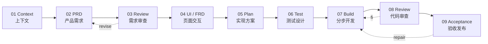
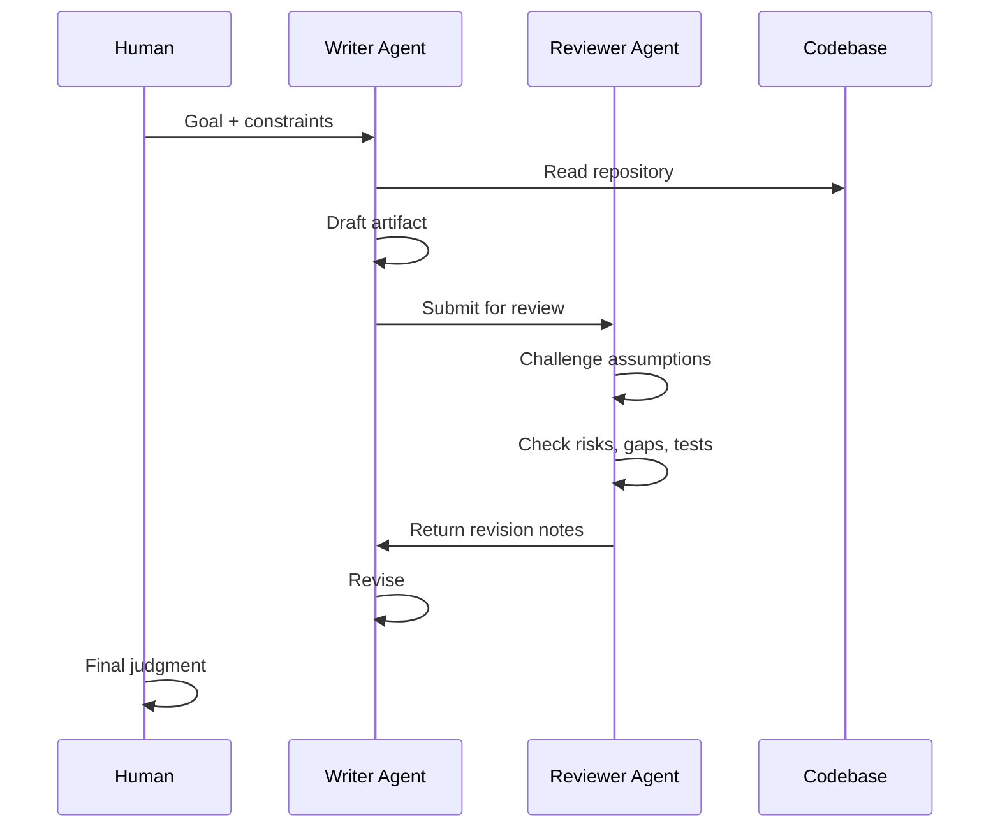

[Uploading README.md…]()
<div align="center">

# ⚡ Agentic Product Engineering Harness

### Context-first · Product-led · Review-gated · Test-verified

<br />


<br />

**A model-agnostic operating harness for turning product intent into production software with AI agents.**

**一套模型无关的 AI 产品工程 Harness：让 AI 从业务意图走向可交付软件。**

</div>

---

## 01 · What This Is / 这是什么

This repository is a **workflow harness** for AI coding agents.

It is not a prompt collection.  
It is not a set of random coding tricks.  
It is not a “one sentence → full app” fantasy.

It is a structured operating system for AI-assisted product engineering:

```txt
Context → PRD → Review → UI/FRD → Implementation Plan → Test Plan → Stepwise Build → Review → Acceptance
```

本仓库是一套面向 AI Coding Agent 的工作流 Harness。

它不是 Prompt 摘抄。  
不是技巧合集。  
也不是“一句话生成完整系统”的幻想。

它的核心目标是：

```txt
先理解上下文 → 再定义产品 → 再拆实现 → 再设计测试 → 再分步写代码 → 再审查验收
```

---

## 02 · Core Thesis / 核心观点

Most AI coding failures are not model failures.

They are workflow failures.

AI usually fails because it starts too late in the process: directly at code.

This harness moves AI earlier into the product engineering chain:

- understand the project
- clarify the product
- challenge the requirement
- design the interaction
- plan the implementation
- design the tests
- build in small steps
- review before merge
- accept before release

大多数 AI 编程失败，不是因为模型不会写代码。  
而是因为流程从一开始就错了。

AI 不应该直接从代码开始。  
AI 应该从上下文和产品判断开始。

---

## 03 · Operating Protocol / 运行协议



### Non-negotiable Gates / 不可跳过的门禁

```txt
No context  → no PRD
No PRD      → no implementation
No plan     → no code
No tests    → no merge
No review   → no release
```

```txt
没有上下文，不写 PRD
没有 PRD，不做实现
没有实现方案，不写代码
没有测试，不合并
没有审查，不发布
```

---

## 04 · Skill Stack / Skills 体系

```txt
skills/
├── 01-context-engineer
├── 02-prd-writer
├── 03-prd-reviewer
├── 04-ui-frd-writer
├── 05-implementation-planner
├── 06-test-designer
├── 07-stepwise-builder
├── 08-code-reviewer
└── 09-acceptance-gate
```

| Skill | Mission | 中文目标 |
|---|---|---|
| `context-engineer` | Understand the project before making decisions. | 先读懂项目，再做判断。 |
| `prd-writer` | Turn vague intent into structured product requirements. | 把模糊想法转成结构化 PRD。 |
| `prd-reviewer` | Challenge scope, boundaries, risks, and acceptance. | 审查范围、边界、风险和验收标准。 |
| `ui-frd-writer` | Convert product logic into page-level interaction requirements. | 把产品逻辑转成页面级交互需求。 |
| `implementation-planner` | Break requirements into executable engineering steps. | 把需求拆成可执行的工程步骤。 |
| `test-designer` | Design verification before implementation. | 在写代码前设计验证方式。 |
| `stepwise-builder` | Build one small, reviewable change at a time. | 一次只做一个可审查的小改动。 |
| `code-reviewer` | Audit correctness, maintainability, safety, and regression risk. | 审查正确性、可维护性、安全和回归风险。 |
| `acceptance-gate` | Decide whether the work is ready to ship. | 判断是否达到交付标准。 |

---

## 05 · Writer / Reviewer Loop / 双 Agent 机制



The Writer is optimized for creation.  
The Reviewer is optimized for skepticism.  
The human remains the final decision maker.

Writer 负责生成。  
Reviewer 负责质疑。  
人负责最终判断。

---

## 06 · Supported Agent Interfaces / 支持的 Agent 接口

This harness is model-agnostic.  
It works best when the agent can read files, follow persistent instructions, edit code, run commands, and produce artifacts.

本 Harness 不绑定某一个模型。  
只要 Agent 能读取仓库文件、遵守长期指令、修改代码、运行命令并产出文档，就可以使用。

The repository includes adapters for:

```txt
CLAUDE.md                 → Claude Code / Claude-style agents
AGENTS.md                 → Codex / OpenAI coding agents / agents.md-compatible tools
GEMINI.md                 → Gemini CLI
.cursor/rules/*.mdc       → Cursor
skills/*/SKILL.md         → Claude Skills-style skill loaders
```

---

## 07 · Example: AI Phone / 示例：AI 电话

### Bad Request / 不好的请求

```txt
Build an AI phone system.
```

```txt
做一个 AI 电话系统。
```

This is too vague.  
The agent may produce a demo, but not a product.

这个请求太模糊。  
AI 很可能做出一个“能演示但不能交付”的系统。

---

### Better Context / 更好的上下文

```txt
We are building an AI phone product.

The system answers inbound calls, understands caller intent, verifies identity when needed,
retrieves or updates structured records, sends confirmation messages,
and escalates calls to a human when confidence is low or the scenario is out of scope.

The first version focuses on operational workflows:
- live call handling
- call status monitoring
- call detail review
- exception queue
- outbound call tasks
- human handoff
- audit trail
```

```txt
我们正在开发一个 AI 电话产品。

系统负责接听来电、识别用户意图、在需要时完成身份确认、
读取或更新结构化记录、发送确认消息，
并在置信度不足或超出处理范围时转人工。

第一版聚焦运营流程：
- 实时通话处理
- 通话状态监控
- 通话详情查看
- 异常队列
- 外呼任务
- 人工接管
- 操作审计
```

---

## 08 · Quick Start / 快速开始

### Claude Code

```bash
cp CLAUDE.md your-project/CLAUDE.md
cp -R skills your-project/.claude/skills
```

### Codex / AGENTS.md-compatible agents

```bash
cp AGENTS.md your-project/AGENTS.md
```

### Gemini CLI

```bash
cp GEMINI.md your-project/GEMINI.md
```

### Cursor

```bash
mkdir -p your-project/.cursor/rules
cp .cursor/rules/agentic-product-engineering.mdc your-project/.cursor/rules/
```

Then start with:

```txt
Use the harness.
Do not write code yet.
Start with 01_CONTEXT.md.
```

```txt
使用本 Harness。
先不要写代码。
从 01_CONTEXT.md 开始。
```

---

## 09 · Acceptance Checklist / 验收清单

```txt
[ ] Context reviewed
[ ] PRD approved
[ ] PRD reviewed by Reviewer
[ ] UI / FRD completed
[ ] Implementation plan approved
[ ] Test plan approved
[ ] Code implemented step by step
[ ] Unit tests passed
[ ] Integration tests passed
[ ] E2E tests passed
[ ] Lint passed
[ ] Type check passed
[ ] Build passed
[ ] Regression risk reviewed
[ ] Human acceptance completed
```

```txt
[ ] 上下文已审查
[ ] PRD 已确认
[ ] PRD 已由 Reviewer 审查
[ ] UI / FRD 已完成
[ ] 实现方案已确认
[ ] 测试计划已确认
[ ] 代码已分步骤实现
[ ] 单元测试通过
[ ] 集成测试通过
[ ] E2E 测试通过
[ ] Lint 通过
[ ] 类型检查通过
[ ] 构建通过
[ ] 回归风险已审查
[ ] 人工验收完成
```

---

## 10 · Philosophy / 哲学

The future of software development is not:

> “AI writes everything.”

The future is:

> **Humans design the system of work.  
> AI executes inside that system.**

未来的软件开发不是：

> “AI 自己写一切。”

而是：

> **人设计工作系统，AI 在系统内执行。**

The better the harness, the better the agent.

Harness 越好，Agent 越强。  
边界越清楚，产出越稳定。  
验收越严格，交付越可靠。

---

<div align="center">

## Context before code.  
## Review before merge.  
## Confidence before release.

<br />

## 先上下文，后代码。  
## 先审查，后合并。  
## 先确认，再发布。

</div>
