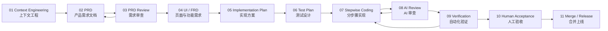
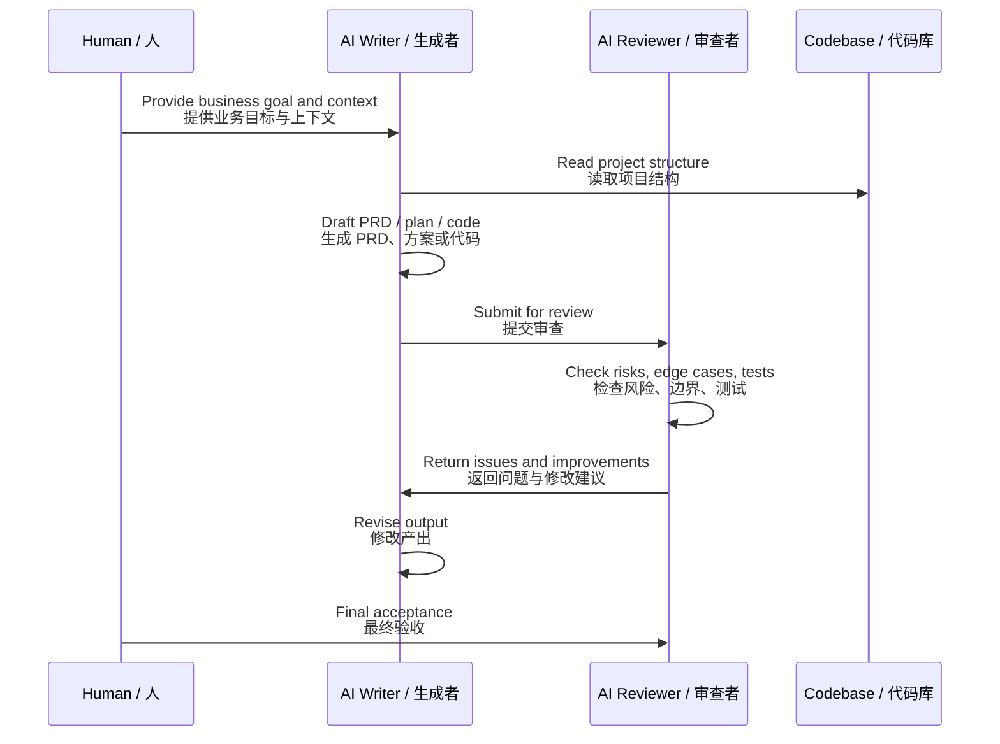

<div align="center">

# 🧠 Auren AI Engineering Skills  
### AI-Native Product Engineering · 产品优先的 AI 工程化开发体系


<br />

**Build with context. Review with skepticism. Ship with confidence.**  
**先理解业务，再设计产品；先控制风险，再交付代码。**

</div>

---

## ✦ Overview / 项目简介

**Auren AI Engineering Skills** is a high-discipline skill system for building real AI-native software with Claude Code, Codex, Cursor, and other AI coding agents.

It is not a random prompt collection.  
It is a structured workflow that turns AI coding from a “one-shot gamble” into a **controlled, reviewable, testable, and production-ready engineering process**.

**Auren AI Engineering Skills** 不是普通 Prompt 仓库，也不是“给 AI 一句话让它直接写代码”的玩法。  
它是一套面向真实产品开发的 AI 工程流程：让 AI 在明确上下文、需求边界、实现方案、测试设计和验收标准之后，再进入代码实现。

> **The goal is not to stop humans from reading code.  
> The goal is to move human attention from low-level code details to product judgment, workflow design, acceptance criteria, and risk control.**
>
> **重点不是“人完全不看代码”，而是把人的注意力从代码细节，转移到业务判断、流程设计、验收标准和风险控制上。**

---

## ✦ Core Belief / 核心理念

Most people misunderstand vibe coding.

They think it means:

> “Give AI one sentence and wait for it to write the whole app.”

That is not production engineering.

Real AI-native development should be:

> **Context first. PRD before implementation. Tests before merge. Human judgment above AI output.**

很多人误解了 vibe coding，以为它就是：

> “给 AI 一句话，然后等它自动写完整个系统。”

这不是工程化开发。  
真正可靠的 AI 编程，应该是一套可控流程：

> **先做上下文工程，再写 PRD；先写实现文档，再写代码；先设计测试，再合并上线。**

---

## ✦ The Auren Method / Auren 方法论

The Auren Method combines two layers:

Auren 方法论由两部分组成：

### 1. Product-First AI Development / 产品优先的 AI 开发

Before AI writes code, it must understand:

在 AI 写代码之前，必须先理解：

- business background / 业务背景
- user roles / 用户角色
- product scope / 产品范围
- out-of-scope boundaries / 不做什么
- core workflows / 核心流程
- system dependencies / 系统依赖
- data model / 数据模型
- API boundaries / 接口边界
- UI interaction requirements / 页面与交互要求
- edge cases / 边界情况
- acceptance criteria / 验收标准

This is especially important for complex products such as:

尤其适合复杂业务系统，例如：

- AI phone receptionist for Australian GP clinics / 澳洲 GP 诊所 AI 电话客服
- medical document classification / 医疗文档分类系统
- receptionist operation dashboard / 前台接线工作台
- exception queue and human handoff / 异常队列与人工接管
- 3CX / Best Practice / Halo integrations / 3CX、BP、Halo 系统集成
- SMS confirmation and outbound workflow / 短信确认与外呼流程
- admin deployment console / 管理员部署与配置后台

### 2. Review-Gated Vibe Coding / 带审查门禁的 Vibe Coding

Every key output should be produced by a **Writer** and challenged by a **Reviewer**.

每一个关键产出都应该由两个 AI 角色配合完成：

- **Writer**: creates the artifact / 负责生成内容
- **Reviewer**: audits, questions, and improves it / 负责审查、质疑、发现问题并提出修改意见

This reduces common AI development risks:

这样可以降低 AI 开发中最常见的风险：

- misunderstood requirements / 需求理解偏差
- missing edge cases / 边界情况遗漏
- over-engineered implementation / 技术方案过度复杂
- weak database design / 数据结构设计不合理
- incomplete API design / 接口设计不完整
- poor UI state handling / UI 状态处理不足
- insufficient tests / 测试覆盖不足
- risky large commits / 一次性大规模改动风险高
- hidden regression / 隐性回归问题

---

## ✦ Workflow / 工作流



---

## ✦ Writer / Reviewer Loop / Writer 与 Reviewer 结对流程



---

## ✦ Skill Pipeline / Skills 流水线

| Stage | Skill | English Purpose | 中文说明 |
|---|---|---|---|
| 01 | `context-engineer` | Understand project structure, business logic, database, APIs, UI patterns, deployment, and risks. | 理解项目结构、业务逻辑、数据库、接口、UI 模式、部署方式和风险。 |
| 02 | `prd-writer` | Convert rough business ideas into a clear product requirement document. | 将粗略业务想法转化为清晰的产品需求文档。 |
| 03 | `prd-reviewer` | Challenge the PRD for missing scope, unclear boundaries, and hidden risks. | 审查 PRD 中的范围遗漏、边界不清和隐藏风险。 |
| 04 | `ui-frd-writer` | Translate PRD into page-level UI and interaction requirements. | 将 PRD 转化为页面级 UI 与交互需求。 |
| 05 | `implementation-planner` | Break the requirement into database, backend, frontend, API, state, permission, and migration steps. | 拆解数据库、后端、前端、接口、状态、权限和迁移步骤。 |
| 06 | `test-designer` | Design unit, integration, E2E, regression, lint, type-check, and build tests before coding. | 在写代码前设计单测、集成测试、E2E、回归、lint、类型检查和构建验证。 |
| 07 | `stepwise-builder` | Implement one small step at a time according to the implementation plan. | 严格按照实现文档，一次只完成一个小步骤。 |
| 08 | `code-reviewer` | Review generated code for correctness, maintainability, security, and regression risk. | 审查 AI 生成代码的正确性、可维护性、安全性和回归风险。 |
| 09 | `acceptance-gate` | Verify final output against PRD, implementation plan, and test plan before merge. | 合并前对照 PRD、实现方案和测试计划完成验收。 |

---

## ✦ Artifact Chain / 标准产物链

Every serious feature should produce artifacts in this order:

每一个正式功能都应该按顺序产出以下文档：

```txt
01_CONTEXT.md
02_PRD.md
03_PRD_REVIEW.md
04_UI_FRD.md
05_IMPLEMENTATION_PLAN.md
06_TEST_PLAN.md
07_STEPWISE_COMMITS.md
08_REVIEW_REPORT.md
09_ACCEPTANCE_REPORT.md
```

The rule is simple:

规则很简单：

> **No code before context.  
> No implementation before PRD.  
> No merge before verification.**
>
> **没有上下文，不写代码。  
> 没有 PRD，不做实现。  
> 没有验证，不做合并。**

---

## ✦ Recommended Repository Structure / 推荐仓库结构

```txt
.
├── README.md
├── skills/
│   ├── context-engineer/
│   │   └── SKILL.md
│   ├── prd-writer/
│   │   └── SKILL.md
│   ├── prd-reviewer/
│   │   └── SKILL.md
│   ├── ui-frd-writer/
│   │   └── SKILL.md
│   ├── implementation-planner/
│   │   └── SKILL.md
│   ├── test-designer/
│   │   └── SKILL.md
│   ├── stepwise-builder/
│   │   └── SKILL.md
│   ├── code-reviewer/
│   │   └── SKILL.md
│   └── acceptance-gate/
│       └── SKILL.md
│
├── docs/
│   ├── context/
│   ├── product/
│   ├── ui/
│   ├── engineering/
│   ├── testing/
│   └── acceptance/
│
└── examples/
    ├── ai-phone-receptionist/
    ├── document-classification/
    └── admin-deployment-console/
```

---

## ✦ Feature Development Protocol / 功能开发协议

### 01. Context First / 先做上下文工程

Before writing any PRD, implementation plan, or code, AI must understand the existing project.

在写 PRD、实现方案或代码之前，AI 必须先理解当前项目。

The context analysis should include:

上下文分析至少包括：

- existing folder structure / 现有目录结构
- existing modules / 现有功能模块
- coding style / 代码风格
- database schema / 数据库结构
- API patterns / API 设计方式
- frontend component patterns / 前端组件模式
- permission model / 权限模型
- error handling / 错误处理方式
- testing strategy / 测试策略
- deployment flow / 部署流程
- current technical debt / 当前技术债
- regression risks / 回归风险

Output:

产出：

```txt
01_CONTEXT.md
```

---

### 02. PRD Before Code / 先写 PRD，再写代码

The PRD should answer:

PRD 必须回答：

- What problem are we solving? / 这个需求解决什么问题？
- Who are the users? / 用户是谁？
- What is the core workflow? / 核心使用流程是什么？
- What is in scope? / 本期做什么？
- What is out of scope? / 本期不做什么？
- What are the edge cases? / 有哪些边界情况？
- What permissions are involved? / 是否涉及权限？
- What notifications are involved? / 是否涉及通知？
- What data will be created or changed? / 会新增或修改哪些数据？
- What is the success standard? / 成功标准是什么？

Output:

产出：

```txt
02_PRD.md
```

---

### 03. PRD Review / 审查 PRD

The Reviewer must challenge the PRD before implementation.

Reviewer 必须在实现前审查 PRD。

Review focus:

审查重点：

- unclear requirements / 需求是否不清楚
- missing user scenarios / 用户场景是否遗漏
- hidden business risks / 是否存在隐藏业务风险
- ambiguous boundaries / 边界是否模糊
- weak acceptance criteria / 验收标准是否太弱
- missing exception flows / 异常流程是否缺失
- possible compliance concerns / 是否存在合规风险
- third-party dependency risks / 第三方系统依赖是否有风险

Output:

产出：

```txt
03_PRD_REVIEW.md
```

---

### 04. UI / FRD / 页面与功能需求文档

For user-facing features, the UI / FRD must describe:

对于用户可见功能，UI / FRD 必须描述：

- page purpose / 页面目标
- user role / 使用角色
- entry point / 入口位置
- main actions / 核心操作
- empty state / 空状态
- loading state / 加载状态
- error state / 错误状态
- success state / 成功状态
- table columns / 表格字段
- filters / 筛选项
- forms / 表单
- modals / 弹窗
- permission behavior / 权限表现
- edge cases / 边界情况

Output:

产出：

```txt
04_UI_FRD.md
```

---

### 05. Implementation Plan / 实现文档

The implementation plan must be specific enough that an AI coding agent can execute it step by step.

实现文档必须足够具体，让 AI Coding Agent 可以按步骤执行，而不是自由发挥。

It should include:

实现文档应该包括：

- database changes / 数据库变更
- migration strategy / 数据迁移策略
- backend services / 后端服务
- API endpoints / API 接口
- validation rules / 校验规则
- frontend components / 前端组件
- state management / 状态管理
- permission checks / 权限校验
- error handling / 错误处理
- compatibility with existing logic / 与现有逻辑兼容
- rollback considerations / 回滚策略

Output:

产出：

```txt
05_IMPLEMENTATION_PLAN.md
```

---

### 06. Test Plan Before Coding / 写代码前设计测试

Testing is not an afterthought.

测试不是代码写完后的补丁，而是实现前就应该设计好的验收机制。

Every implementation plan must include:

每个实现方案都必须包含：

- unit tests / 单元测试
- integration tests / 集成测试
- E2E tests / 端到端测试
- regression tests / 回归测试
- permission tests / 权限测试
- edge case tests / 边界测试
- lint / 代码规范检查
- type check / 类型检查
- build verification / 构建验证

Output:

产出：

```txt
06_TEST_PLAN.md
```

---

### 07. Step-by-Step Implementation / 分步骤实现

AI should not modify dozens of files in one uncontrolled pass.

不要让 AI 一次性修改几十个文件，然后再一起提交。  
更稳妥的方式是：

```txt
Implement one small step
→ Run related tests
→ Commit
→ Review
→ Continue
```

中文流程：

```txt
完成一个小步骤
→ 运行对应测试
→ 提交 commit
→ Review
→ 进入下一步
```

Recommended commit style:

推荐提交风格：

```txt
feat(calls): add call status model
feat(calls): implement call list API
feat(calls): add receptionist call table
test(calls): add call filtering tests
fix(calls): handle empty patient match state
```

Output:

产出：

```txt
07_STEPWISE_COMMITS.md
```

---

### 08. AI Review / AI 审查

Before human acceptance, the Reviewer should check:

人工验收前，Reviewer 应检查：

- Does the code match the PRD? / 代码是否符合 PRD？
- Does the code match the implementation plan? / 是否符合实现文档？
- Are all edge cases handled? / 是否处理了所有边界情况？
- Are loading, error, and success states implemented? / 是否实现 loading、error、success 状态？
- Are permissions correct? / 权限是否正确？
- Are database changes safe? / 数据库变更是否安全？
- Are tests meaningful? / 测试是否有效？
- Is the change too broad? / 改动范围是否过大？
- Could it break existing behavior? / 是否可能破坏已有功能？

Output:

产出：

```txt
08_REVIEW_REPORT.md
```

---

### 09. Acceptance Gate / 验收门禁

Before merge, the following must pass:

合并前必须通过：

```txt
unit tests
integration tests
E2E tests
lint
type check
build
manual smoke test
PRD acceptance checklist
```

Final output:

最终产出：

```txt
09_ACCEPTANCE_REPORT.md
```

Only then should the change be merged.

只有通过验收门禁后，才应该合并代码。

---

## ✦ Example: AI Phone Receptionist / 示例：AI 电话客服系统

A bad AI prompt starts like this:

不好的 AI 开发方式是：

```txt
Build a call dashboard.
做一个电话工作台。
```

A better AI-native workflow starts with context:

更好的方式是先提供业务上下文：

```txt
This product is for Australian GP clinics.
Receptionists use it daily.
The system integrates with 3CX and Best Practice.
AI answers calls, identifies intent, verifies patient identity,
checks appointment availability, writes back to BP,
sends SMS confirmations, and escalates exceptions to humans.

这个产品面向澳洲 GP 诊所。
前台每天使用。
系统集成 3CX 和 Best Practice。
AI 负责接听电话、识别意图、验证患者身份、
查询预约可用性、写回 BP、发送短信确认，
并在异常情况下转人工处理。
```

Then the AI should produce:

然后 AI 应该按顺序产出：

```txt
Context analysis
→ Calls module PRD
→ Calls module UI / FRD
→ Calls module implementation plan
→ Calls module test plan
→ Stepwise code implementation
→ AI review
→ Automated verification
→ Human acceptance
```

中文流程：

```txt
上下文分析
→ Calls 模块 PRD
→ Calls 模块 UI / FRD
→ Calls 模块实现文档
→ Calls 模块测试计划
→ 分步骤代码实现
→ AI 审查
→ 自动化验证
→ 人工验收
```

This is how AI becomes reliable in real product development.

这才是 AI 在真实产品开发中变得可靠的方式。

---

## ✦ Example: Medical Document Classification / 示例：医疗文档分类系统

For a medical document classification product, AI should first understand:

对于医疗文档分类系统，AI 首先应该理解：

- document source / 文档来源
- file types / 文件类型
- classification categories / 分类类别
- confidence score / 置信度
- human review workflow / 人工复核流程
- write-back target system / 写回目标系统
- exception handling / 异常处理方式
- audit log / 审计记录
- permission model / 权限模型
- patient privacy boundary / 患者隐私边界

Then proceed through:

然后再进入：

```txt
Context
→ PRD
→ UI / FRD
→ Implementation Plan
→ Test Plan
→ Stepwise Coding
→ Review
→ Acceptance
```

This prevents the AI from building a beautiful but unusable demo.

这样可以避免 AI 做出一个“看起来很好看，但业务不可用”的 demo。

---

## ✦ Quality Principles / 质量原则

### Context Is a First-Class Asset / 上下文是一等资产

Bad context creates bad code.

上下文质量差，代码质量一定不稳定。

AI output quality depends on:

AI 输出质量高度依赖：

- business background / 业务背景
- system boundaries / 系统边界
- existing architecture / 现有架构
- examples / 示例
- edge cases / 边界情况
- acceptance standards / 验收标准

---

### PRD Is Not Bureaucracy / PRD 不是形式主义

A good PRD prevents:

好的 PRD 可以减少：

- wrong implementation / 做错方向
- repeated rework / 反复返工
- unclear UI / 页面不清楚
- unstable architecture / 架构不稳定
- missing edge cases / 边界遗漏
- weak acceptance / 验收困难

PRD is not paperwork.

PRD is risk control.

PRD 不是文书工作。  
PRD 是风险控制。

---

### Tests Are Part of Design / 测试是设计的一部分

Testing should be designed before coding.

测试应该在写代码前设计。

For every feature, ask:

每个功能都要问：

- What should work? / 什么应该成功？
- What should fail? / 什么应该失败？
- What should be blocked? / 什么应该被拦截？
- What should remain unchanged? / 什么不应该被影响？
- What should be backward compatible? / 什么需要兼容旧逻辑？

---

### Small Commits Beat Big Magic / 小步提交胜过一次性大魔法

AI agents are powerful, but large uncontrolled changes are dangerous.

AI 很强，但一次性大规模改动非常危险。

Small steps make AI work:

小步提交让 AI 产出变得：

- reviewable / 可审查
- reversible / 可回滚
- debuggable / 可排查
- testable / 可测试
- explainable / 可解释

---

## ✦ Human Role / 人在流程中的角色

The human is not removed from the process.

人不是从流程中消失，而是站到更高层。

Instead of reviewing every line of code, the human controls:

人不再把主要精力放在每一行代码上，而是控制：

- business direction / 业务方向
- product scope / 产品范围
- user experience / 用户体验
- workflow design / 流程设计
- acceptance criteria / 验收标准
- risk boundaries / 风险边界
- final release decision / 最终发布决策

The AI handles:

AI 负责：

- drafting / 起草
- structuring / 结构化
- implementation / 实现
- testing / 测试
- refactoring / 重构
- reviewing / 审查
- documentation / 文档

This is the real productivity shift.

这才是 AI 编程真正的生产力转移。

---

## ✦ Anti-Patterns / 反模式

Avoid:

避免：

```txt
❌ one-sentence prompt → full app
❌ code before PRD
❌ no reviewer
❌ no test plan
❌ huge multi-file edits
❌ no acceptance checklist
❌ no rollback thinking
❌ merging because “it looks fine”
```

中文：

```txt
❌ 一句话需求 → 直接生成完整系统
❌ 没有 PRD 就写代码
❌ 没有 Reviewer
❌ 没有测试计划
❌ 一次性修改大量文件
❌ 没有验收清单
❌ 没有回滚思考
❌ 因为“看起来可以”就合并
```

Use instead:

推荐：

```txt
✅ context first
✅ PRD before implementation
✅ Writer + Reviewer loop
✅ implementation plan before code
✅ tests before merge
✅ small commits
✅ acceptance gate
✅ human-controlled release
```

中文：

```txt
✅ 先做上下文工程
✅ 先写 PRD，再做实现
✅ Writer + Reviewer 结对
✅ 先写实现文档，再写代码
✅ 合并前必须测试
✅ 小步提交
✅ 验收门禁
✅ 人控制最终发布
```

---

## ✦ Skill Design Standard / Skill 设计标准

Each skill should be written as a clear operating instruction for an AI agent.

每一个 Skill 都应该是一份清晰的 AI 操作指令，而不是一段泛泛而谈的 Prompt。

A good `SKILL.md` should include:

一个好的 `SKILL.md` 应该包括：

- role definition / 角色定义
- when to use this skill / 何时使用
- required inputs / 必要输入
- execution steps / 执行步骤
- required output format / 输出格式
- review checklist / 审查清单
- failure conditions / 失败条件
- anti-patterns / 反模式

Recommended template:

推荐模板：

```md
# Skill Name

## Role
Describe what this skill is responsible for.

## When to Use
Describe when the AI should activate this skill.

## Required Context
List the information that must be collected before execution.

## Process
Step-by-step operating procedure.

## Output
Define the expected artifact and format.

## Review Checklist
Define what must be checked before completion.

## Anti-Patterns
Define what the AI must not do.
```

---

## ✦ Philosophy / 哲学

AI-native development is not about removing engineering discipline.

AI 原生开发不是取消工程纪律。

It is about making engineering discipline faster, clearer, and more repeatable.

它是让工程纪律变得更快、更清晰、更可复用。

The best AI coding workflow is not:

最好的 AI 编程流程不是：

> “Let AI do everything.”  
> “让 AI 自己发挥。”

It is:

> “Design the system so AI can do the right thing, in the right order, with the right constraints.”  
> “设计一套流程，让 AI 在正确的顺序里，带着正确的约束，做正确的事情。”

That is the purpose of this repository.

这就是本仓库的目的。

---

<div align="center">

## Build with context.  
## Review with skepticism.  
## Ship with confidence.

<br />

## 以业务上下文启动。  
## 以审查机制约束。  
## 以测试验收交付。

</div>
